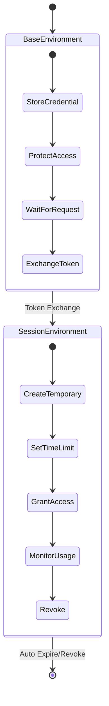
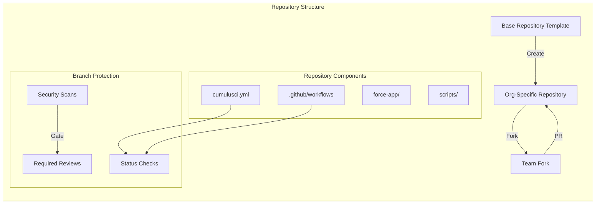
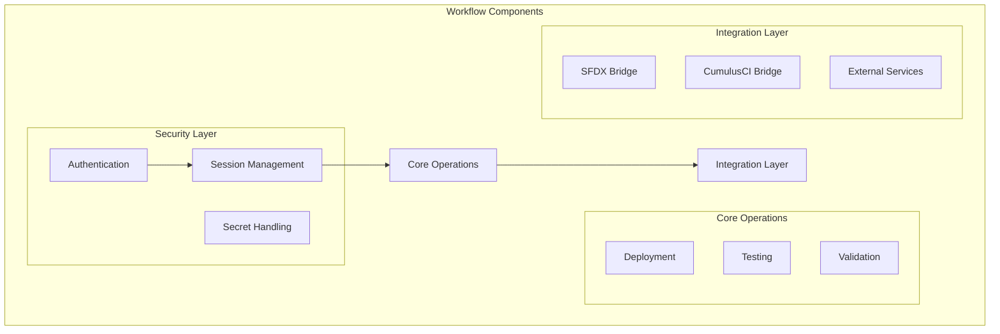
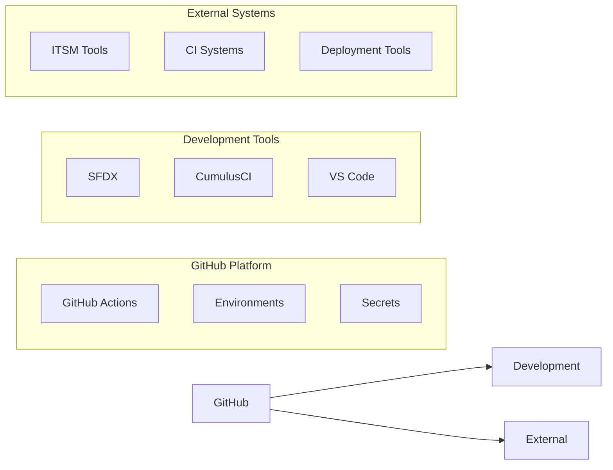

# 🏗️ D2X Technical Architecture

## Core Design Principles

D2X minimizes complexity by leveraging GitHub's platform features rather than building parallel systems. This approach:

-   Makes enterprise features accessible to everyone
-   Reduces security attack surface
-   Enables native integration with GitHub's ecosystem
-   Simplifies maintenance and updates

## 🔐 Environment Structure

The foundation of D2X's security model is GitHub's Environments feature, used in a novel two-stage pattern:

### Base Environment

-   Stores long-lived org credentials (SFDX auth URLs)
-   Implements protection rules and approvals
-   Handles token exchange requests
-   Maintains audit logs

### Session Environment

-   Contains temporary access tokens
-   Auto-expires after configured time
-   Can be instantly revoked
-   Scoped to specific jobs/workflows

[Learn more about environment configuration](./architecture/environments.md)

## 📦 Repository Architecture

D2X uses GitHub's repository features to represent Salesforce orgs and their relationships:

### Repository Types

-   Base templates for different org patterns
-   Org-specific repositories (forked from templates)
-   Team forks for development

### Security Features

-   Branch protection rules
-   Required status checks
-   Automated security scanning
-   Pull request reviews

[Learn more about repository features](./architecture/repositories.md)

## ⚡ Actions & Workflows

D2X provides reusable workflows that leverage GitHub Actions:

### Composable Design

Each workflow is built from smaller, reusable components that can be:

-   Combined in different ways
-   Customized as needed
-   Versioned independently
-   Shared across repositories

[Learn more about workflow patterns](./architecture/workflows.md)

## 🔌 Integration Points

D2X bridges GitHub with your existing tools and processes:

### Native Integrations

-   Seamless SFDX/CumulusCI usage
-   ITSM system connections
-   CI/CD tool bridges
-   Deployment frameworks

[Learn more about integrations](./architecture/integrations.md)
