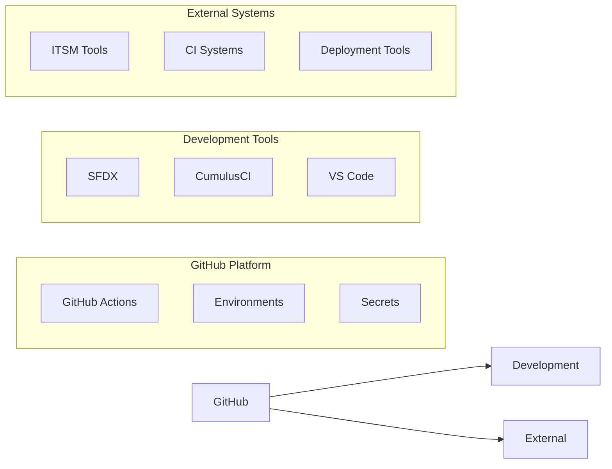

# Integration Points

## Native Integrations

D2X bridges GitHub with your existing tools and processes:

### Native Integrations

- Seamless SFDX/CumulusCI usage
- ITSM system connections
- CI/CD tool bridges
- Deployment frameworks

[Back to Architecture Overview](./index.md)
