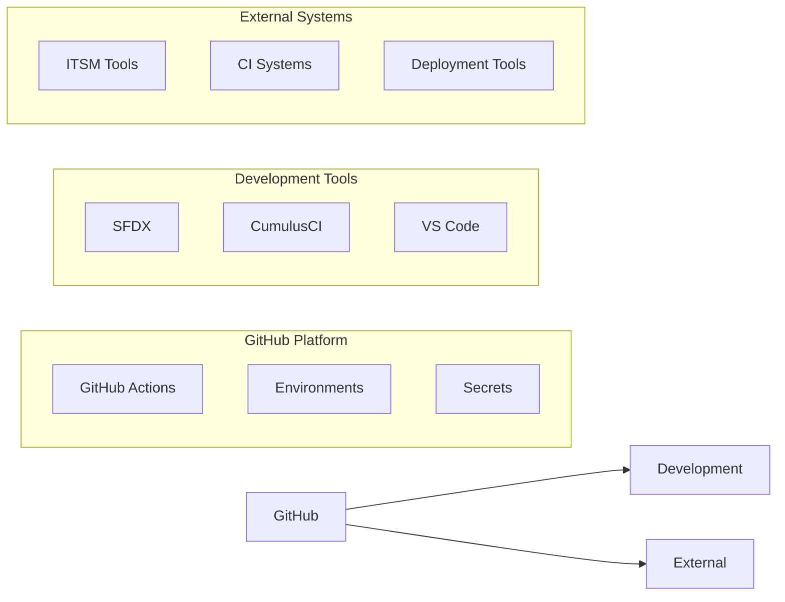

# Workflow Patterns

## Composable Design

D2X workflows are built from smaller, reusable components that can be:

- Combined in different ways
- Customized as needed
- Versioned independently
- Shared across repositories

## Integration Layer

D2X bridges GitHub with your existing tools and processes:

### Native Integrations

- Seamless SFDX/CumulusCI usage
- ITSM system connections
- CI/CD tool bridges
- Deployment frameworks

## Modular Workflows and Reusable Jobs

D2X now includes a set of modular workflows and reusable jobs to streamline and standardize common tasks. These workflows are designed to be configurable and reusable, making it easier to manage and maintain your CI/CD processes.

### New Modular Workflows

1. **Check No Org Workflow**
   - File: `.github/workflows/check-no-org.yml`
   - Description: Checks anything that doesn't require an org.
   - Configuration: No specific configuration required.

2. **Create Feature Test Package Workflow**
   - File: `.github/workflows/create-feature-test-package.yml`
   - Description: Creates the feature test package.
   - Configuration: No specific configuration required.

3. **Create Test Scratch Org Workflow**
   - File: `.github/workflows/create-test-scratch-org.yml`
   - Description: Creates the test scratch org and its environment using d2x commands.
   - Configuration: No specific configuration required.

4. **Configure Org for Testing Workflow**
   - File: `.github/workflows/configure-org-for-testing.yml`
   - Description: Configures the org for testing by running `cci flow run ci_feature_2gp --skip-from run-tests`.
   - Configuration: No specific configuration required.

5. **Run Tests Workflow**
   - File: `.github/workflows/run-tests.yml`
   - Description: Runs the tests by executing `cci flow run ci_feature_2gp --start-from`.
   - Configuration: No specific configuration required.

6. **Dispose Org Workflow**
   - File: `.github/workflows/dispose-org.yml`
   - Description: Disposes of the org with options for keeping the org based on conditions and snapshotting the org using CumulusCI.
   - Configuration: No specific configuration required.

7. **Create Org Workflow**
   - File: `.github/workflows/create-org.yml`
   - Description: Creates orgs using a scratchdef path, CLI options, or a CumulusCI scratch profile name, and runs against a DevHub environment with `D2X_SF_ROLE=devhub-scratch`.
   - Configuration: No specific configuration required.

### Reusable Jobs

1. **Check Conditions Job**
   - Description: Checks conditions for various workflows.
   - Configuration: No specific configuration required.

2. **Set Default Org Job**
   - Description: Sets the default org for various workflows.
   - Configuration: No specific configuration required.

3. **Capture Build History Job**
   - Description: Captures the build history for various workflows.
   - Configuration: No specific configuration required.

[Back to Architecture Overview](./index.md)
