# 🌐 D2X: DevOps for the Entire Salesforce Ecosystem

## Why One Solution Matters

The Salesforce ecosystem is diverse, from nonprofits leveraging NPSP to Fortune 500 enterprises managing complex global implementations. Traditional DevOps solutions force these different audiences to choose between oversimplified tools that don't scale, or complex platforms that require significant investment in both cost and expertise.

D2X is the first Salesforce DevOps solution built to serve the entire ecosystem through three core principles:

-   🎯 **Easy**: Start with simple workflows, grow when ready
-   ⚡ **Efficient**: Automate everything that should be automated
-   🔧 **Extensible**: Build on proven patterns, customize when needed

## 🏢 Enterprise Organizations

Enterprise Salesforce implementations demand enterprise-grade solutions. D2X integrates seamlessly with existing ITSM systems while providing the security and compliance features large organizations require.

```mermaid
flowchart TB
    subgraph "Enterprise Org Management"
        subgraph "GitHub Platform"
            ProdEnv["🔐 Production Environment"]
            UATEnv["UAT Environment"]
            DevEnv["Dev Environment"]

            subgraph "Security"
                SecretScan["Secret Scanning"]
                GHAS["Advanced Security"]
                Audit["Audit Logs"]
            end

            subgraph "Automation"
                Actions["GitHub Actions"]
                Workflows["Reusable Workflows"]
            end
        end

        subgraph "ITSM Integration"
            SN["ServiceNow"]
            Jira["Jira"]
            ITSM["Other ITSM"]
        end

        subgraph "Salesforce Orgs"
            PROD["Production"]
            UAT["UAT Sandboxes"]
            DEV["Dev Sandboxes"]
            SCRATCH["Scratch Orgs"]
        end

        ProdEnv -->|"Gated Deploy"| PROD
        UATEnv -->|"Deploy"| UAT
        DevEnv -->|"Deploy"| DEV
        Actions -->|"Create"| SCRATCH

        SN -.->|"Change Request"| ProdEnv
        Jira -.->|"Tickets"| Actions
        ITSM -.->|"Approvals"| ProdEnv
    end
```

### Security & Compliance That Scales

The two-stage credential management system provides enterprise-grade security while simplifying access management. By leveraging GitHub's Advanced Security features, D2X enables:

-   Automated secret scanning and rotation
-   Comprehensive audit trails
-   Compliance reporting
-   Role-based access control

[Learn more about enterprise features](./audiences/enterprise.md)

## 📦 ISVs & Package Developers

For ISVs, speed and reliability in package development directly impacts revenue. D2X streamlines the entire development lifecycle while meeting AppExchange security requirements.

### Optimized Package Development

D2X's composable automation approach means ISVs can build once, reuse everywhere:

-   Automated scratch org creation and setup
-   Standardized security review preparation
-   Streamlined customer org deployments

[Learn more about ISV features](./audiences/isv.md)

## 🤝 Consulting Partners

System Integrators face the unique challenge of managing multiple clients with different needs. D2X's composable approach turns repeated patterns into reusable assets.

```mermaid
flowchart TB
    subgraph "SI Partner Collaboration Model"
        subgraph "GitHub Security"
            PartnerOrg["Partner GitHub Organization"]
            ClientEnv["Client-Specific Environments"]
            SecretStore["🔐 Credential Management"]
        end

        subgraph "Development Teams"
            Partners["Partner Teams"]
            Clients["Client Teams"]
            Reviews["Code Reviews"]
        end

        subgraph "Client Orgs"
            Prod["Production Orgs"]
            Sand["Sandboxes"]
            Scratch["Scratch Orgs"]
        end

        PartnerOrg -->|"Secure Access"| SecretStore
        SecretStore -->|"Temporary Credentials"| Partners
        Partners -->|"Submit"| Reviews
        Clients -->|"Approve"| Reviews
        Reviews -->|"Deploy"| Prod
        Reviews -->|"Deploy"| Sand
        Partners -->|"Create"| Scratch
    end
```

### Template-Based Efficiency

Start with proven patterns and customize for each client's needs:

-   Standardized project templates
-   Secure credential management
-   Client-specific customizations
-   Knowledge transfer automation

[Learn more about partner features](./audiences/partner.md)

## 🌱 Small Teams & Nonprofits

With GitHub's free offering for nonprofits, D2X makes enterprise-grade DevOps accessible to everyone. Start simple and grow as needed.

```mermaid
flowchart TB
    subgraph "Nonprofit Automation"
        subgraph "GitHub Free"
            NPSPFlow["NPSP Update Workflows"]
            AutoFlow["Automation Workflows"]
            SecureEnv["🔐 Secure Environments"]
        end

        subgraph "Automated Tasks"
            SandboxRefresh["Sandbox Refresh"]
            DataMask["Data Masking"]
            TestData["Test Data Load"]
            Config["Config Updates"]
        end

        subgraph "Salesforce Orgs"
            Prod["Production"]
            Sand["Sandbox"]
            NPSP["NPSP Updates"]
        end

        NPSPFlow -->|"Auto Update"| NPSP
        AutoFlow -->|"Automate"| SandboxRefresh
        SandboxRefresh -->|"Refresh"| Sand
        AutoFlow -->|"Run"| DataMask
        AutoFlow -->|"Load"| TestData
        SecureEnv -->|"Secure Access"| Prod
    end
```

### Start Where You Are

D2X grows with your team:

-   Simple GitHub-based workflows
-   Pre-built NPSP integration
-   Secure by default
-   Clear upgrade paths

[Learn more about nonprofit features](./audiences/nonprofit.md)

## 🎯 Choose Your Path

Every organization's DevOps journey is different. Select your starting point:

-   [Enterprise Guide](./guides/enterprise-start.md)
-   [ISV Guide](./guides/isv-start.md)
-   [Partner Guide](./guides/partner-start.md)
-   [Small Team Guide](./guides/small-team-start.md)
