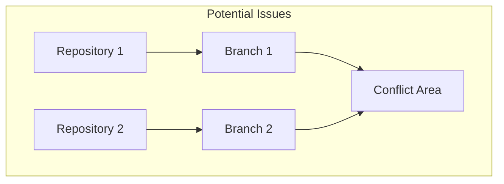
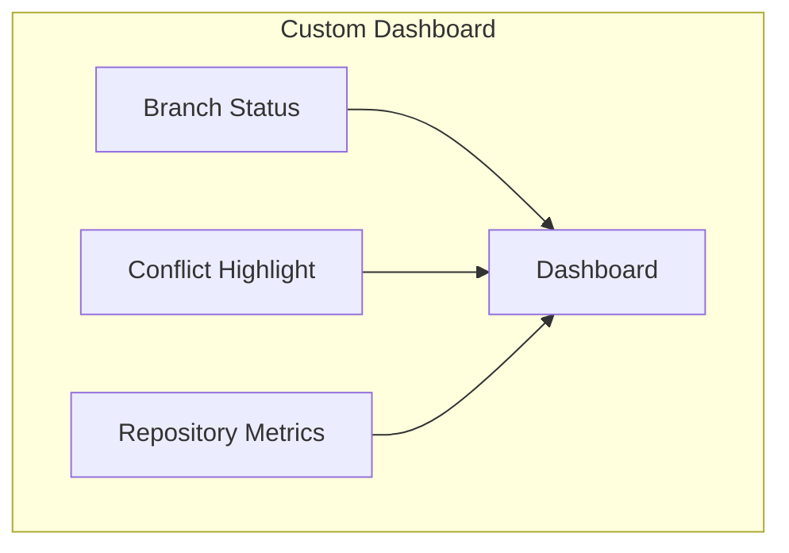

# 🌐 Advanced Network Graph Features

## Identifying Potential Issues and Conflicts

The Network graph in GitHub can be used to identify potential issues and conflicts in the deployment and configuration of modules. By visualizing the relationships between repositories, you can spot areas where changes might conflict or where there might be issues with merging branches.

### Example

Consider a scenario where multiple teams are working on different forks of a repository. The Network graph can help you identify branches that have diverged significantly and might cause conflicts when merged. By analyzing the graph, you can proactively address these issues before they become problematic.

## Tips and Best Practices

Using the Network graph effectively requires some best practices and tips to manage complex repository structures and relationships.

### Best Practices

1. **Regularly Review the Graph**: Make it a habit to regularly review the Network graph to stay informed about the state of your repositories.
2. **Communicate with Teams**: Use the insights from the Network graph to communicate with teams about potential issues and coordinate efforts to resolve them.
3. **Merge Frequently**: Encourage teams to merge changes frequently to minimize the risk of conflicts and keep branches up to date.
4. **Use Descriptive Branch Names**: Use descriptive branch names to make it easier to understand the purpose of each branch in the Network graph.

## Customizing and Extending the Network Graph

The Network graph in GitHub can be customized and extended to meet specific needs in D2X projects. By leveraging GitHub's API and other tools, you can create custom visualizations and integrations.

### Custom Visualizations

You can use GitHub's API to fetch data about the relationships between repositories and create custom visualizations that provide additional insights. For example, you can create a dashboard that shows the status of different branches, highlights potential conflicts, and provides metrics on the health of your repositories.

### Integrations

Integrate the Network graph with other tools and systems to enhance its functionality. For example, you can integrate it with your CI/CD pipeline to automatically update the graph with the latest changes and provide real-time insights into the state of your repositories.

### Example

Consider a scenario where you want to create a custom dashboard that shows the status of different branches and highlights potential conflicts. You can use GitHub's API to fetch the necessary data and create a visualization that provides a clear and interactive view of your repository relationships.

By customizing and extending the Network graph, you can tailor it to meet the specific needs of your D2X projects and gain deeper insights into the state of your repositories.
