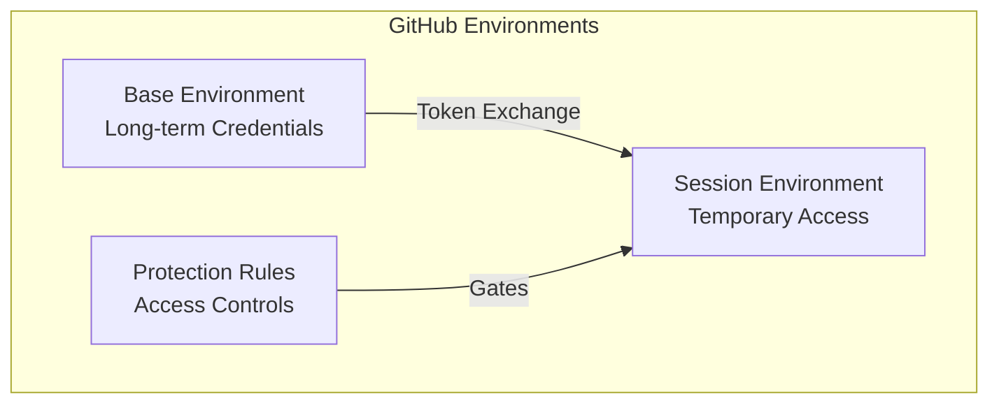
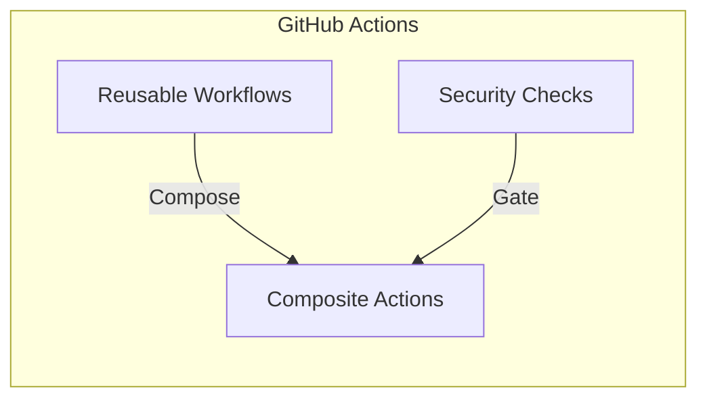

# ⚙️ GitHub Platform Features

D2X leverages GitHub's platform features in novel ways to create a secure, scalable DevOps solution:

## 🏗️ Core Platform Features

### Environments

GitHub Environments become a secure credential vault and access management system:

### Actions

Reusable workflows enable composable automation while maintaining security:

### Advanced Security

Native security features protect your entire pipeline:

-   Secret scanning
-   Code scanning
-   Dependency analysis
-   Security policies

### Repository Features

From wikis to projects, every feature serves a purpose:

-   Branch protection
-   Status checks
-   Automated reviews
-   Documentation
