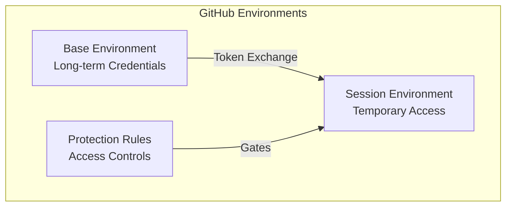
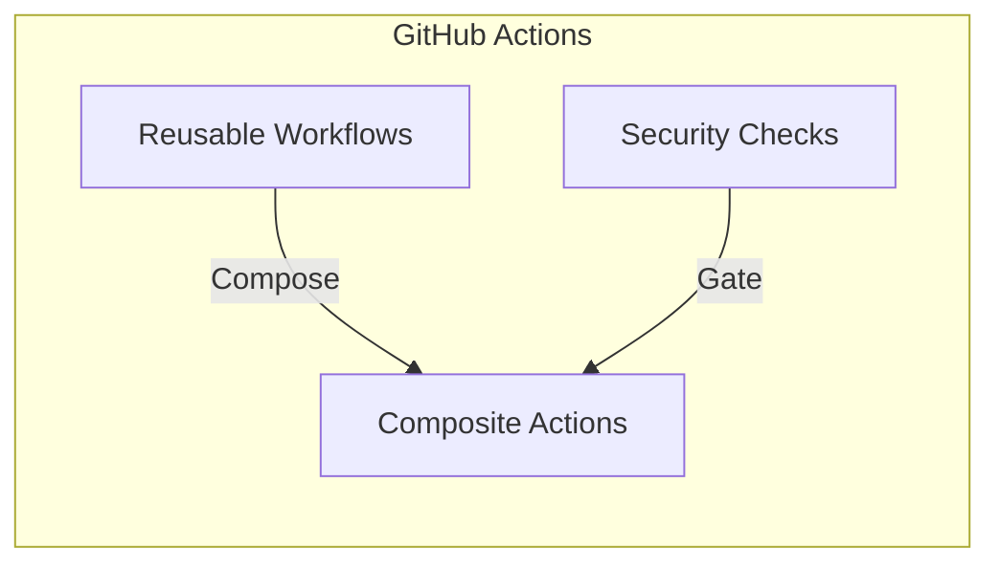

# ⚙️ GitHub Platform Features

D2X leverages GitHub's platform features in novel ways to create a secure, scalable DevOps solution:

## 🏗️ Core Platform Features

### Environments

GitHub Environments become a secure credential vault and access management system:

### Actions

Reusable workflows enable composable automation while maintaining security:

### Advanced Security

Native security features protect your entire pipeline:

-   Secret scanning
-   Code scanning
-   Dependency analysis
-   Security policies

### Repository Features

From wikis to projects, every feature serves a purpose:

-   Branch protection
-   Status checks
-   Automated reviews
-   Documentation

### Network Graph

The Network graph in GitHub is a powerful tool that allows you to visualize the relationships between repositories, including forks and branches. It provides a clear and interactive way to understand how different repositories are connected and how changes flow between them.

[Learn more about the Network graph](./network-graph.md)

[Learn more about advanced Network graph features](./advanced-network-graph.md)
