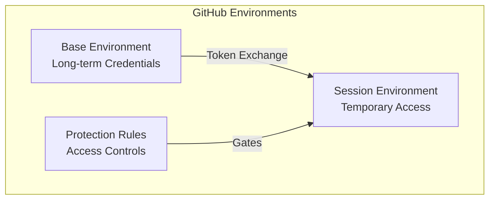
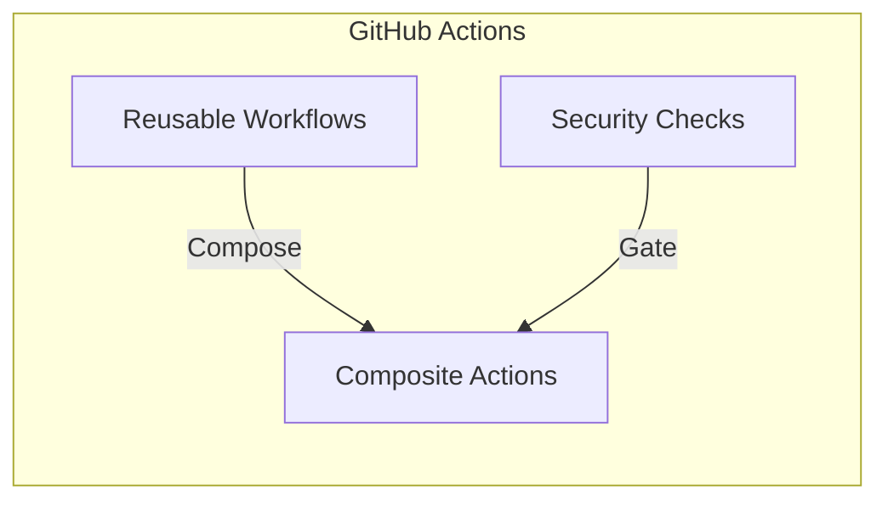
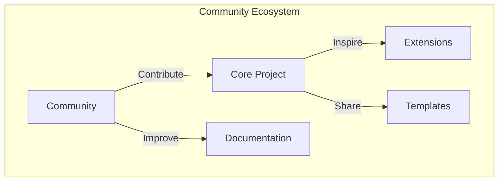

# ⚙️ GitHub Platform Features

D2X leverages GitHub's platform features in novel ways to create a secure, scalable DevOps solution:

## 🏗️ Core Platform Features

### Environments

GitHub Environments become a secure credential vault and access management system:

### Actions

Reusable workflows enable composable automation while maintaining security:

### Advanced Security

Native security features protect your entire pipeline:

-   Secret scanning
-   Code scanning
-   Dependency analysis
-   Security policies

### Repository Features

From wikis to projects, every feature serves a purpose:

-   Branch protection
-   Status checks
-   Automated reviews
-   Documentation

[Learn more about GitHub features](./features/index.md)

# 🤝 Community

## Open Source at Heart

D2X is built in the open, leveraging GitHub's collaboration features to create a vibrant ecosystem where everyone benefits.

## Ways to Contribute

-   💡 Share ideas in Discussions
-   🐛 Report issues
-   🔀 Submit pull requests
-   📚 Improve documentation

## Getting Help

-   📖 Documentation
-   💬 Community discussions
-   🎓 Learning resources
-   👥 User groups

[Join the community on GitHub](https://github.com/muselab-d2x/d2x/discussions)

## Looking Forward

Together, we're building a future where secure, scalable Salesforce DevOps is accessible to everyone. Whether you're managing a single org or hundreds, your experience and ideas can help shape this future.
