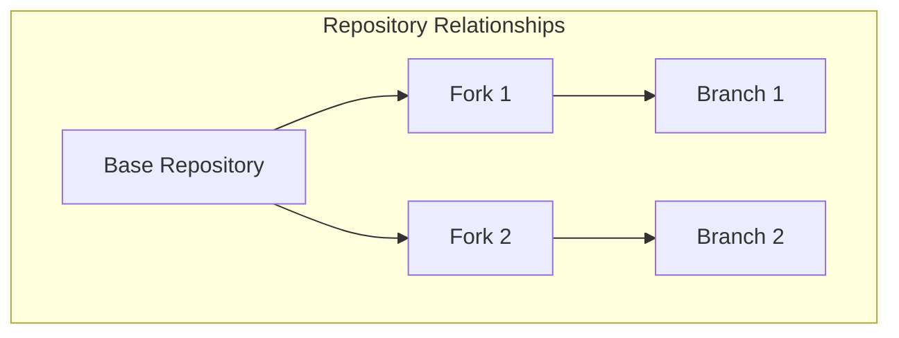
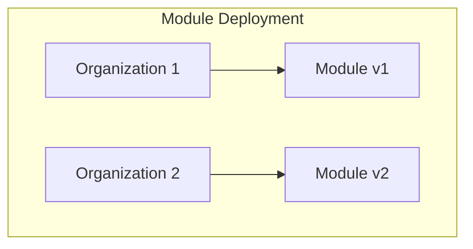

# 🌐 Network Graph Overview

## Visualizing Relationships Between Repositories

The Network graph in GitHub is a powerful tool that allows you to visualize the relationships between repositories, including forks and branches. It provides a clear and interactive way to understand how different repositories are connected and how changes flow between them.

### Example

Consider a scenario where you have a base repository for a project, and multiple forks of this repository are created by different teams or organizations. The Network graph can help you visualize how these forks are related to the base repository and to each other. It shows the branches within each repository and how changes are merged or diverged.

## Maintaining a Map of Module Deployment and Configuration

The Network graph can be particularly useful for maintaining a map of a module's deployment and configuration across different organizations. By visualizing the forks and branches, you can track where and how a module is being deployed, identify which versions are in use, and understand the configuration differences between deployments.

### Example

Imagine you have a module that is deployed across multiple organizations, each with its own fork of the repository. The Network graph can help you see which organizations are using which versions of the module, and how their configurations differ. This can be invaluable for managing updates, troubleshooting issues, and ensuring consistency across deployments.

## Accessing and Interpreting the Network Graph

To access the Network graph in GitHub, navigate to the main page of a repository, click on the "Insights" tab, and then select "Network" from the sidebar. The Network graph will display a visual representation of the repository's forks and branches.

### Interpreting the Graph

- **Nodes**: Each node represents a commit in the repository.
- **Lines**: Lines between nodes represent the flow of changes between commits.
- **Branches**: Different branches are shown as separate lines, allowing you to see how they diverge and merge.
- **Forks**: Forks of the repository are displayed as separate lines branching off from the main repository.

By analyzing the Network graph, you can gain insights into the development history, collaboration patterns, and deployment status of your modules.
