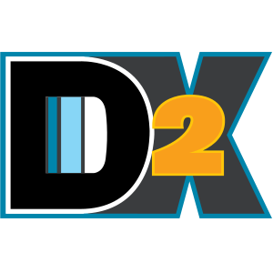

# 🚀 The Future of D2X: Implementing Salesforce Well-Architected DevOps

## 🎯 The Vision

The Salesforce [Well-Architected Framework](https://architect.salesforce.com/well-architected/overview) establishes that a truly adaptable solution "evolves with the business" through resilient and composable architecture. As the framework states:

> "Composable solutions adjust quickly and with greater stability. Composable architectures are built in units that operate gracefully with one another, and can be swapped in and out of service."

GitHub has built the platform capabilities needed to bring this vision to life. D2X serves as the catalyst that transforms these principles and capabilities into practical, accessible DevOps practices for every Salesforce org.

## 🏗️ Why GitHub-Native?

Development teams today are drowning in platforms, credentials, and complexity. As explored in our series on [Securing Salesforce DevOps: Least Privilege Access Control](https://muselab.com/bench-notes/securing-salesforce-devops-least-privilege-access-control), traditional approaches to credential management introduce significant security risks. By building directly on GitHub's platform features, we can eliminate entire categories of security and maintenance concerns while providing a more integrated, intuitive experience.

## 🔐 Rethinking Security

The [challenge of securely splitting GitHub Actions workflows](https://muselab.com/bench-notes/securing-salesforce-devops-multi-job-workflows-in-github-actions) showcases why we need a new approach to credential management. The heart of D2X's vision is bringing enterprise-grade security practices to every Salesforce org through GitHub's platform features, aligning with both the [Trusted](https://architect.salesforce.com/well-architected/trusted) principle and the [Application Lifecycle Management](https://architect.salesforce.com/well-architected/adaptable/resilient/application-lifecycle-management) guidance of Well-Architected.

🔍 [Learn more about our security architecture](./architecture/security.md)
🔑 [Learn more about our credential management approach](./architecture/credentials.md)

## 🧩 Composable Automation

Following the Well-Architected [Composable](https://architect.salesforce.com/well-architected/adaptable/composable) principle, we're reimagining how automation should work in the Salesforce ecosystem. As outlined in our vision for [The Composable Delivery Model](https://muselab.com/bench-notes/introducing-the-composable-delivery-model), we're breaking everything down into composable pieces that can be mixed and matched to suit any development pattern.

⚡ The beauty of composable automation is that it scales both up and down:

-   🏢 Large enterprises can implement complex deployment strategies
-   📦 ISVs can manage package development and customer deployments
-   👥 Small teams can start simple and grow
-   🤝 Nonprofits get pre-built automation for common needs

🛠️ [Learn more about our automation architecture](./architecture/automation.md)
📋 [Learn more about our workflow patterns](./workflows/index.md)

## 🌟 For Everyone

Whether you're a Fortune 500 company, a growing ISV, a small business, or one of the 40,000+ nonprofits running on Salesforce (who can now access all of this for free through GitHub for Nonprofits), D2X is evolving to be your perfect DevOps companion.

## 🤝 Let's Build Together

This democratization of Salesforce DevOps is ambitious, but it's the right path forward. By building on GitHub's platform and maintaining our commitment to open source, we can make the Well-Architected vision a reality for everyone.

Join us in the [GitHub Discussions](https://github.com/muselab-d2x/d2x/discussions) to help shape this future. Whether you're managing a single org or hundreds, your experience and needs matter in building a DevOps solution that truly works for everyone.

## 🗺️ Explore the Vision

-   [For Different Audiences](./audiences/index.md)
-   [Technical Architecture](./architecture/index.md)
-   [Workflow Patterns](./workflows/index.md)
-   [GitHub Features Utilization](./github/index.md)
-   [Community and Support](./community/index.md)

# Previous Docs: Retained for now... Introducing D2X

D2X is an open source collection of tools and configurations to quickly launch and easily maintain Salesforce development projects on GitHub. D2X combines the best of CumulusCI, Salesforce CLI, GitHub Actions, and GitHub Codespaces. D2X projects are set up to align with the Salesforce Well-Architected principle of [Adaptable (Resilient and Composable)](https://architect.salesforce.com/well-architected/adaptable/overview).

D2X is made up of:

-   A Docker image with the latest versions of CumulusCI and SF CLI preinstalled

    -   GitHub Package: https://github.com/muselab-d2x/d2x/pkgs/container/d2x
    -   Latest Docker Image: `ghcr.io/muselab-d2x/d2x:latest`

-   A set of [reusable GitHub Actions workflows](https://github.com/muselab-d2x/d2x/tree/main/.github/workflows)
-   A [devcontainer](https://containers.dev) [configuration](https://github.com/muselab-d2x/d2x/tree/main/.devcontainer) for use with GitHub Codespaces or any IDE with a Devcontainers extension
-   A [project template](https://github.com/muselab-d2x/d2x-template) using [cookiecutter](https://cookiecutter.readthedocs.io)

D2X is a project of [MuseLab](https://muselab.com) and was created to support our [consulting services](https://muselab.com/services) with Salesforce partners and customers. We proudly share D2X as open source with the Salesforce community as part of our goal to revolutionize and democratize Salesforce DevOps.

## Starting a D2X Project

The easiest way to get started is with [D2X Launchpad](https://launchpad.muselab.com) which provides a simple web interface to launching new GitHub repositories fully configured for D2X.

## Post-Launch Tutorial

You've created your own GitHub repository using [D2X Launchpad](https://launchpad.muselab.com), now what?

Head over to the [D2X Project Tutorial](tutorial.md) for next steps on finalizing your project's setup and getting started building.

## D2X `cumulusci-next`

Learn more about advance features of CumulusCI contained in Muselab's preview `cumulusci-next` branch of `d2x` and the corresponding Docker image tag to try out new features like Scratch Org Snapshot management, additional yaml loadable from the command line, a simple plugin framework, and more.

Check out [D2X cumulusci-next](cumulusci-next.md) for more details.

## Troubleshooting

Need help troubleshooting an error? Check out the [Troubleshooting](troubleshooting.md) section for common error messages and tips on debugging issues.

## Resources

D2X itself doesn't require a lot of documentation. It's really about stitching together some amazingly powerful tools. Learning those tools is an important part of learning to work with D2X. The following documentation provides resouces to learn about those tools:

-   [CumulusCI Documentation](https://cumulusci.readthedocs.io)
-   [Trailhead: Build Applications with CumulusCI](https://trailhead.salesforce.com/content/learn/trails/build-applications-with-cumulusci)
-   [Salesforce CLI](https://developer.salesforce.com/tools/salesforcecli)
