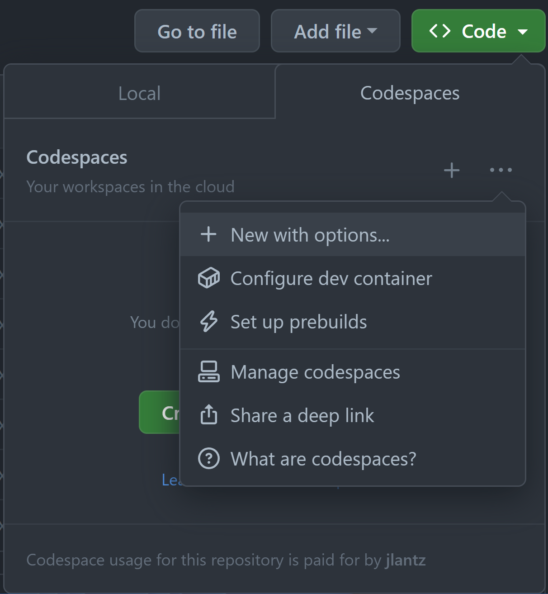
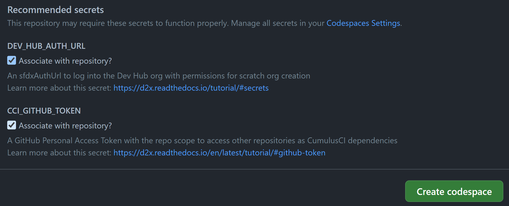

# D2X Project Tutorial

This tutorial assumes you've already created a D2X project repository on GitHub. If you haven't yet done that, please refer to the documentation on [Starting a D2X Project](index.md#starting-a-d2x-project).

## DevHub and Packaging Org

You will need access to a [Salesforce org with DevHub enabled](https://developer.salesforce.com/docs/atlas.en-us.sfdx_dev.meta/sfdx_dev/sfdx_setup_enable_devhub.htm) to run [GitHub Actions](https://docs.github.com/en/actions) builds and create scratch orgs in [GitHub Codespaces](https://docs.github.com/en/codespaces/overview).

For the DevHub, it is possible to use the [Limited Access - Free](https://developer.salesforce.com/docs/atlas.en-us.sfdx_dev.meta/sfdx_dev/dev_hub_license.htm?q=limited%20access) license for the user you use in Actions and Codespaces.

If you specified a namespace prefix, you will need to make sure the namespace is [registered with your DevHub](https://developer.salesforce.com/docs/atlas.en-us.sfdx_dev.meta/sfdx_dev/sfdx_dev_unlocked_pkg_create_namespace.htm?q=namespace).

If you created a 1GP Managed project, you will also need admin access to a packaging org, a [Salesforce Developer Edition org with the package's namespace prefix registered](https://developer.salesforce.com/docs/atlas.en-us.pkg1_dev.meta/pkg1_dev/register_namespace_prefix.htm).

### Getting an SfdxAuthUrl for an Org

To do this, you can use sfdx either on your computer or via Codespaces.

**via Codespaces** If you don't already have sfdx installed on your computer and connected to your DevHub, you can [use a Codespace](#launching-a-development-environment) to connect to the DevHub so you can get the sfdxAuthUrl. Simply launch a new Codespace from your D2X project repository then run: sfdx org login device --set-default-dev-hub --alias DevHub

**via sfdx** Assuming you already have sfdx installed on your computer and connected to your DevHub as the alias DevHub, you should be able to get the Sfdx Auth Url (starts with force://) by running sfdx org display -o DevHub --verbose andy copying the auth url (starts with force://, ends with .salesforce.com)

## GitHub Token

GitHub Actions and GitHub Codespaces both generate a default API token that's limited to the current repository. D2X projects can support dependencies on other D2X project repositories via [CumulusCI's Dependency Management](https://cumulusci.readthedocs.io/en/stable/dev.html#manage-dependencies). The challenge is that the default GitHub Actions and GitHub Codespaces tokens don't have access to any other repositories for CumulusCI Dependency Management to work.

The solution is to [generate a GitHub Personal Access Token](https://docs.github.com/en/authentication/keeping-your-account-and-data-secure/managing-your-personal-access-tokens) and set it as the value for the `CCI_GITHUB_TOKEN` secret.

## Secrets

Finishing your project's configuration requires setting [GitHub Actions Secrets for the repository or organization](https://docs.github.com/en/actions/security-guides/using-secrets-in-github-actions).

The following secrets need to be set in all projects:

* `DEV_HUB_AUTH_URL`: The [SfdxAuthUrl providing access to the DevHub](#devhub-and-packaging-org)

* `GH_EMAIL`: The GitHub user account email to be associated with the workflows.

Projects with dependencies need set:

* `CCI_GITHUB_TOKEN`: The [GitHub Personal Access Token providing access to repositories](#github-token)

1GP Managed projects need to set:

* `PACKAGING_ORG_AUTH_URL`: The [SfdxAuthUrl proving access to the packaging org](#devhub-and-packaging-org)

For GitHub Actions secrets, we recommend setting the secret at the GitHub Organization level (this requires a paid plan) so that it is automatically shared with new repositories created with D2X Launchpad. If you don't want to set secrets at the organization level or want to use a free plan, you will have to set the GitHub Actions secrets up on each newly created repository.

For GitHub Codespaces, you will be prompted to enter the secrets when you launch your first Codespace. The secrets will be saved as personal GitHub Codespaces secrets under your GitHub Account. You can read more about [GitHub Codespaces Secrets in GitHub's Documentation](https://docs.github.com/en/codespaces/managing-codespaces-for-your-organization/managing-secrets-for-your-repository-and-organization-for-github-codespaces#recommended-secrets-for-a-repository)

## Develop

### Launching a development environment

We recommend using GitHub Codespaces as development environments for greater productivity, reduced developer tooling support burden, and security. Codespaces provides on-demand, web based VS Code instances. D2X provides a customized Codespaces image that includes all the right tooling versions and configurations.

To launch a Codespace, click on the green Code button in your repository. Then, click on the ellipse icon at to the of the dropdown and select **New with options** (do not click the Create Codespace on main button!)



You should then see a form to launch a Codespace. Leave the defaults at the top and go to the **Recommended Secrets** section. If you created your CCI_GITHUB_TOKEN and DEV_HUB_AUTH_URL Codespaces secrets already, you will see checkboxes to add them to your repository. If you don't have the secrets set, you'll be given a text field to paste the secrets you collected earlier.



If you don't see this form, you likely accidentally clicked the **Create Codespace on main** button and need to create a new Codespace using  **New with options**.

You can also use any [IDE that support the devcontainer specification](https://containers.dev/supporting).

### Creating your first scratch org

Assuming you have all your secrets set up correctly, you should be able to run the following command in the terminal:

```
cci flow run dev_org
```

If there are errors, you'll likely want to double check the GitHub Codespace Secrets.

### Open the scratch org

Open up the scratch org in a browser and make some metadata changes like adding a field:

```
cci org browser
```

### Capture your changes

List changes from the scratch org:
```
cci task run list_changes
```

Filter down the list to remove any metadata you don't want:
```
cci task run list_changes --exclude Profile:,Layout:
```

Retrieve the changes:
```
cci task run retrieve_changes --exclude Profile:,Layout:
```

### Commit the changes

Your Codespace is set up with both the git command line interface or Visual Studio Code's GitHub Extension if you prefer a graphical interface.

First, create a branch:
```
git checkout -b feature/add-field
```

Add the files, commit the changes, and push the new branch to GitHub:
```
git add force-app/
git commit -m "Added field"
git push --set-upstream-to feature/add-field
```

## Feature Builds

Your first feature branch commit will kick off your first Feature Test build in GitHub Actions. Click on the Actions tab at the top of your repository to view the build status.

Assuming everything looks good, create a [GitHub Pull Request](https://docs.github.com/en/pull-requests/collaborating-with-pull-requests/proposing-changes-to-your-work-with-pull-requests/creating-a-pull-request) to merge the `feature/add-field` branch into `main`.

Then, merge the Pull Request to main to kick off your first Beta Test build.

## Beta Builds

New merges to the `main` branch will kick off the Beta Test build. Check the Actions tab again to monitor the status of the Beta Test build.

When the Beta Test is passing, you're now ready to create a production release of the package.

## Production Release

Go to the Actions tab again and click on the Production Release under Workflows on the left. Then click on the Run Workflow button on the right to launch a build that will promote the latest 2GP beta version to production, create a Git tag, create a GitHub Release, and run a test of the release in a new scratch org.

## Conclusion

With some basic setup, your project is now configured for a fully automated product lifecycle on GitHub. Check out the [Resources](index.md#resources) section to learn more about the tools included in D2X.
