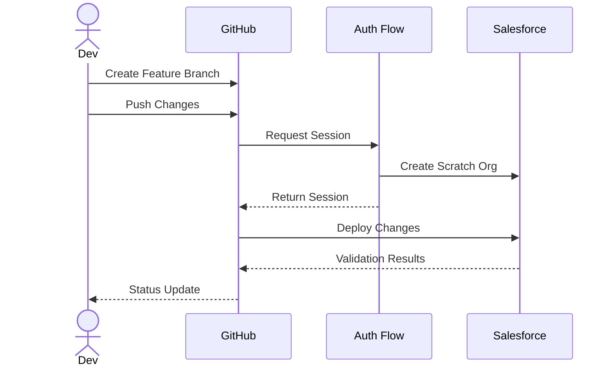
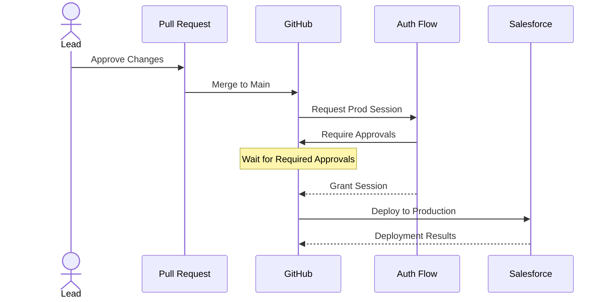

# 🚀 Deployment Patterns

## Feature Branch Deployment

Feature branch deployment is a process where changes are deployed to a feature branch for testing and validation before being merged into the main branch.

### Steps

1. **Create Feature Branch**: Developers create a new feature branch from the main branch.
2. **Push Changes**: Developers push their changes to the feature branch.
3. **Request Session**: GitHub requests a session from the authentication flow.
4. **Create Scratch Org**: Salesforce creates a scratch org for the feature branch.
5. **Deploy Changes**: GitHub deploys the changes to the scratch org.
6. **Validation Results**: Salesforce returns validation results to GitHub.
7. **Status Update**: GitHub provides a status update to the developer.

### Diagram

## Production Deployment

Production deployment is the process of deploying changes to the production environment after they have been tested and approved.

### Steps

1. **Approve Changes**: Lead approves the changes in the pull request.
2. **Merge to Main**: Pull request is merged into the main branch.
3. **Request Prod Session**: GitHub requests a production session from the authentication flow.
4. **Require Approvals**: Authentication flow requires necessary approvals.
5. **Grant Session**: Authentication flow grants the session after approvals.
6. **Deploy to Production**: GitHub deploys the changes to the production environment.
7. **Deployment Results**: Salesforce returns deployment results to GitHub.

### Diagram

[Back to Workflow Overview](./index.md)
