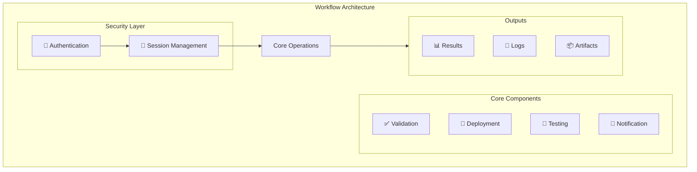
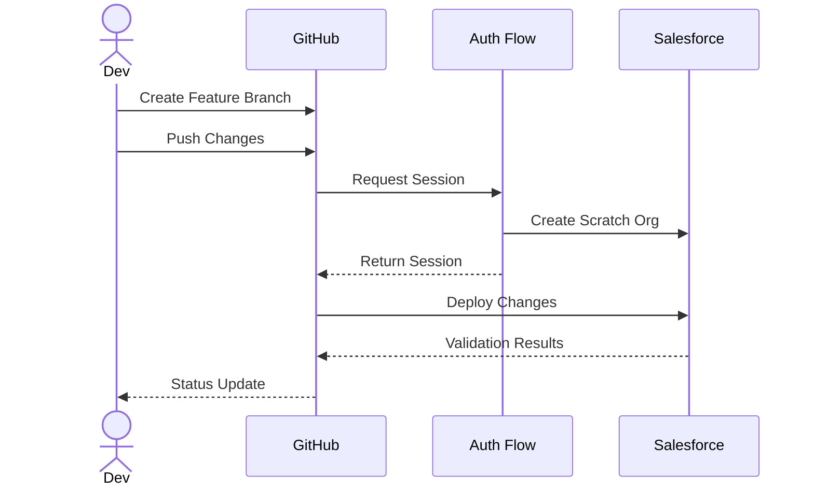
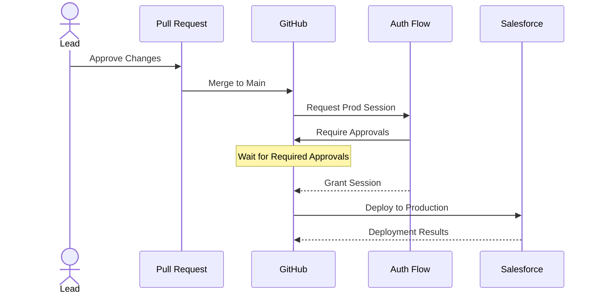
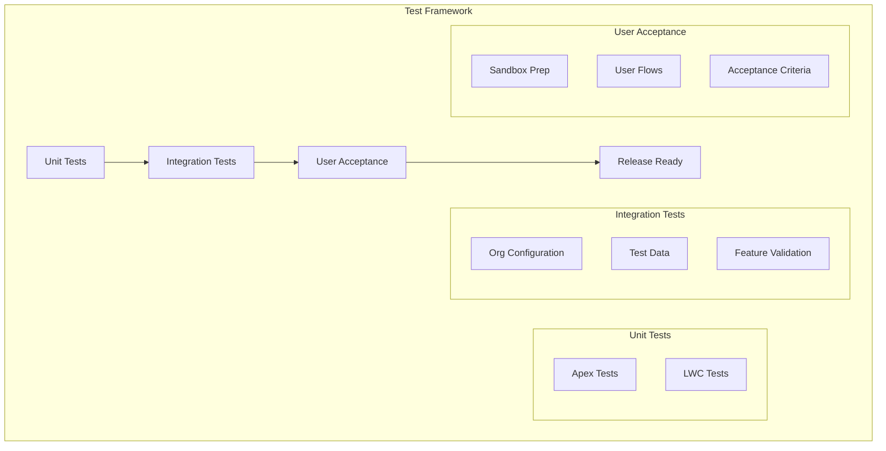
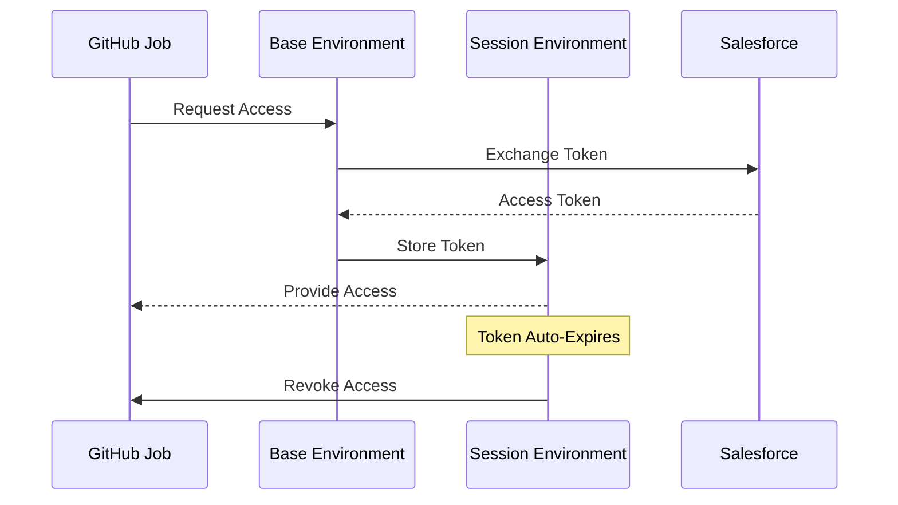
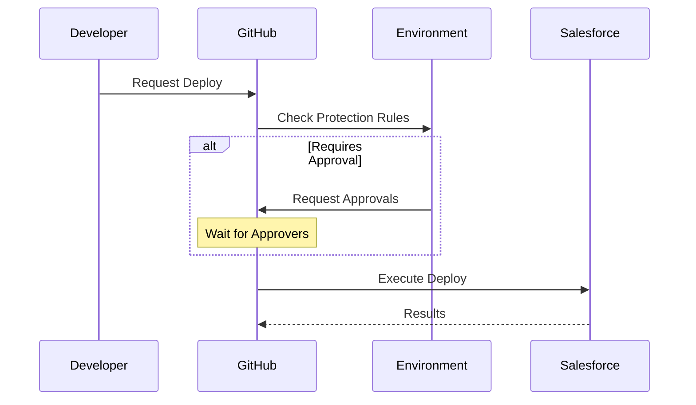
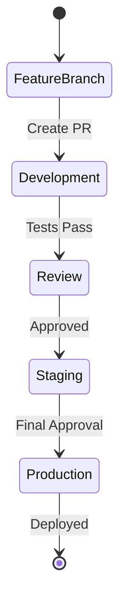
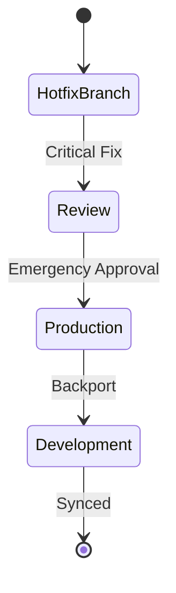

# 🔧 D2X Workflow Patterns

## Core Concepts

D2X workflows are built on two key principles:

-   🧩 Small, composable pieces that can be mixed and matched
-   🔐 Security-first design with credential isolation

## 🚀 Deployment Patterns

### Feature Branch Deployment

### Production Deployment

[Learn more about deployment patterns](./workflows/deployment.md)

## 🧪 Testing Frameworks

D2X provides reusable testing patterns that can be composed into comprehensive test suites:

[Learn more about testing frameworks](./workflows/testing.md)

## 🛡️ Security Workflows

### Two-Stage Authentication

### Protected Deployments

[Learn more about security workflows](./workflows/security.md)

## 📋 Change Management

### Standard Change Flow

### Emergency Change Flow

[Learn more about change management](./workflows/changes.md)

## 🎓 Implementation Examples

Ready to implement these patterns? Start here:

-   [Basic Deployment Setup](./examples/basic-deployment.md)
-   [Complex Testing Pipeline](./examples/test-pipeline.md)
-   [Enterprise Change Management](./examples/change-management.md)
-   [Security Implementation](./examples/security-setup.md)
