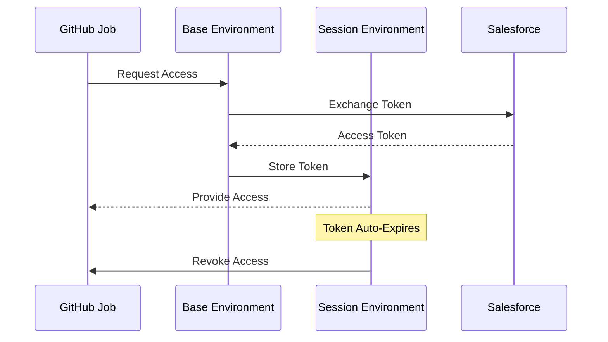
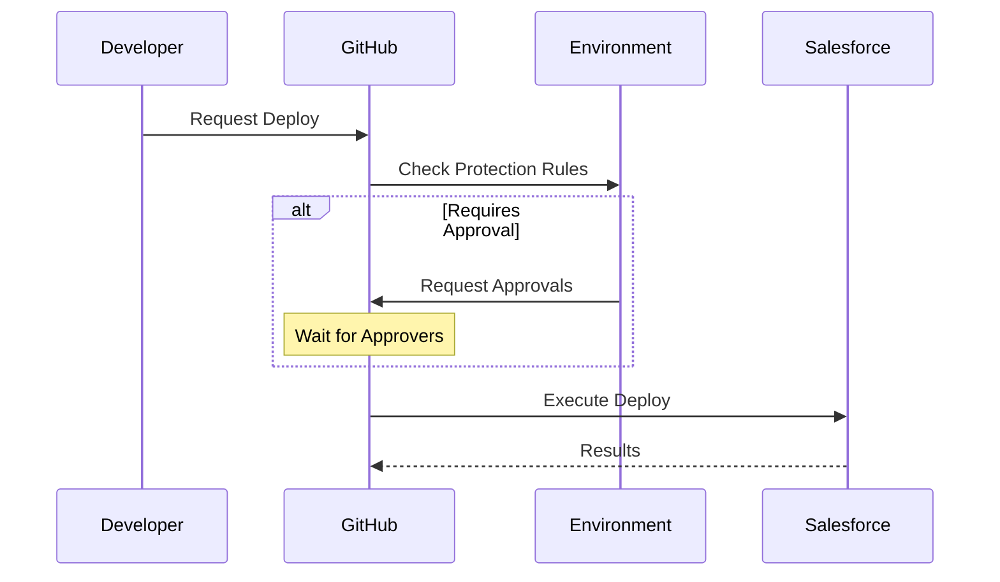

# 🛡️ Security Workflows

## Two-Stage Authentication

Two-stage authentication is a process that separates long-term credentials from temporary access tokens to enhance security.

### Steps

1. **Request Access**: The GitHub job requests access from the base environment.
2. **Exchange Token**: The base environment exchanges the token with Salesforce.
3. **Store Token**: The session environment stores the token.
4. **Provide Access**: The session environment provides access to the GitHub job.
5. **Auto-Expire**: The token auto-expires after a configured time.
6. **Revoke Access**: The session environment revokes access.

### Diagram

## Protected Deployments

Protected deployments ensure that deployments to production environments are secure and compliant with approval processes.

### Steps

1. **Request Deploy**: The developer requests a deployment.
2. **Check Protection Rules**: GitHub checks the protection rules in the environment.
3. **Request Approvals**: If required, GitHub requests approvals.
4. **Wait for Approvers**: GitHub waits for the necessary approvals.
5. **Execute Deploy**: GitHub executes the deployment to Salesforce.
6. **Deployment Results**: Salesforce returns the deployment results to GitHub.

### Diagram

[Back to Workflow Overview](./index.md)
